<!-- ==================== CABEÇALHO ==================== -->

### 💻 Desenvolvedor • 🎓 Estudante de Redes de Computadores • 🔬 Entusiasta de Tecnologia

 

<!-- ==================== SOBRE MIM ==================== -->

## 👋 Sobre Mim

Sou estudante de **Redes de Computadores**, interessado em desenvolvimento de software, sistemas computacionais, redes, automação e tecnologia.

- 🎓 Estudante de Redes de Computadores
- 💻 Desenvolvimento de Software & Web
- 🌐 Redes de Computadores
- 🔬 Tecnologia & Pesquisa
- 🚀 Desenvolvendo projetos e aprendendo todos os dias

 

<!-- ==================== LINGUAGENS & FERRAMENTAS ==================== -->

### 💻 Linguagens & Tecnologias

 

### 🧰 Ferramentas

 

<!-- ==================== PROJETOS EM DESTAQUE ==================== -->

## 🚀 Projetos em Destaque

### 🛡️ C.I.P.H.E.R.

**Cyber Inspection and Protection Engine for Recovery**

Projeto futuro de pesquisa em **cibersegurança**, focado no desenvolvimento de um **guardião virtual para sistemas computacionais**, capaz de monitorar atividades do sistema, identificar comportamentos anômalos e auxiliar na proteção e recuperação do ambiente computacional.

O projeto pretende explorar técnicas de **detecção baseada em regras** e **Machine Learning para detecção de anomalias**, utilizando métricas do sistema e da rede e avaliando precisão de detecção, tempo de resposta e consumo de recursos.

`Cibersegurança` `Machine Learning` `Redes de Computadores` `Sistemas`

> 💡 **Status:** Planejamento & Pesquisa Futura

 

---

 

### 🌱 C.A.R.R.O.T.

**Control and Analysis Environment for Real-time Terrarium Optimization**

Projeto de monitoramento e análise ambiental voltado inicialmente ao cultivo de **Phaseolus vulgaris (feijão-comum)**, desenvolvido para acompanhar condições importantes do ambiente e auxiliar na identificação de possíveis desvios.

O sistema trabalha com dados de **temperatura, umidade do solo, umidade do ar, pH e luminosidade**, analisando as leituras e gerando um **diagnóstico ambiental** de acordo com faixas definidas para a espécie estudada.

A versão atual conta com um sistema funcional de análise e diagnóstico, enquanto versões futuras pretendem expandir o projeto com **sensores reais, IoT, automação e monitoramento em tempo real**.

`Python` `IoT` `Automação` `Sensores` `Monitoramento Ambiental`

> 🌱 **Status:** Em Desenvolvimento — V0.2

 

---

 

### 🐱 Contribution Cat

Projeto de animação desenvolvido como uma alternativa personalizada ao tradicional **GitHub Contribution Snake**, substituindo a cobra por um **gato siamês em pixel art** que interage com o gráfico de contribuições do GitHub.

O projeto possui um sistema próprio de **animações frame a frame**, com movimentos detalhados do corpo, patas, cabeça, cauda e outras partes do personagem, buscando criar movimentos mais fluidos, naturais e expressivos.

Também conta com um **sistema de seleção de animações e comportamentos**, permitindo que o gato realize diferentes ações enquanto explora o gráfico de contribuições.

`Python` `Pixel Art` `SVG` `Animação` `GitHub`

> 🐱 **Status:** Em Desenvolvimento

 

---

 

### 🥋 Projeto de Judô Balbino

Plataforma web desenvolvida para auxiliar na **organização e divulgação de um projeto social de judô**, reunindo informações importantes para alunos, responsáveis e professores em um único ambiente.

O projeto pretende disponibilizar recursos como **horários de treino, história do projeto, informações sobre os senseis e alunos**, além de ferramentas administrativas para auxiliar na organização interna.

Entre as funcionalidades planejadas estão o **gerenciamento de alunos e graduações, controle de pagamentos, geração de listas, comprovantes e integração com pagamentos via Pix**.

`HTML` `CSS` `JavaScript` `Desenvolvimento Web`

> 🥋 **Status:** Em Desenvolvimento

 

<!-- ==================== ESTATÍSTICAS ==================== -->

## 📊 Estatísticas do GitHub

 

<!-- ==================== CONTATO ==================== -->

## 📬 Contato

Interessado em tecnologia, desenvolvimento, pesquisa ou colaboração em projetos?  
Entre em contato comigo:

  

<!-- LinkedIn será adicionado futuramente -->

 

 

<!-- ==================== RODAPÉ ==================== -->

### 💻 Transformando ideias em projetos, um commit de cada vez.

 

